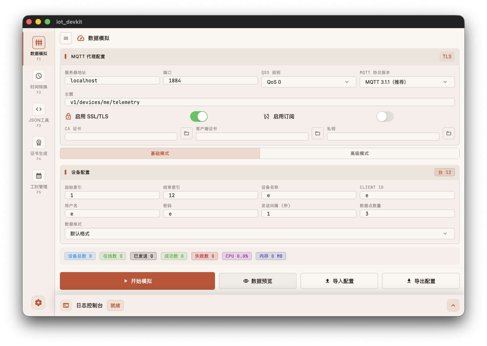
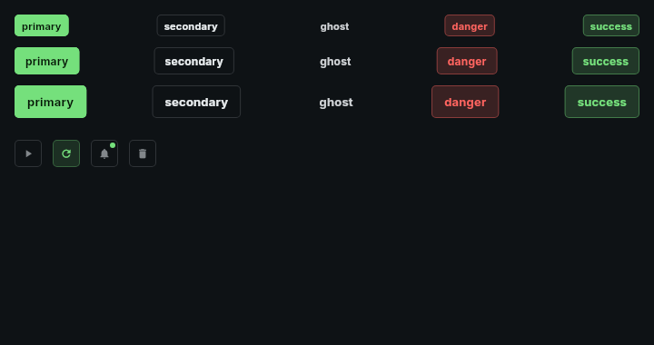
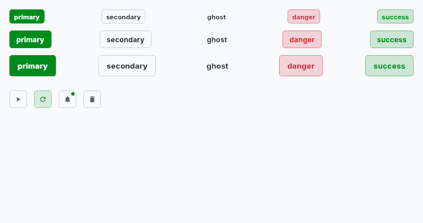
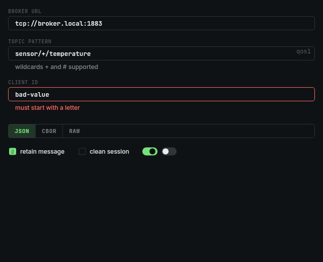
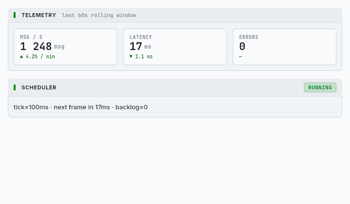
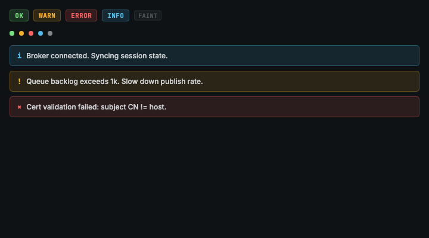
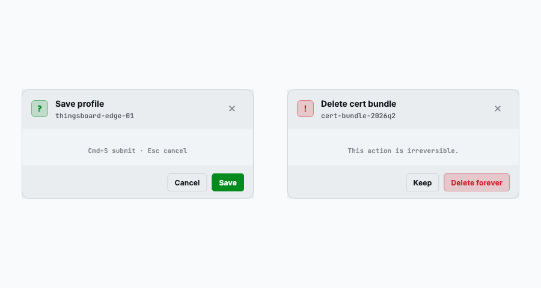

<div align="center">


# IoT DevKit

**A cross-platform desktop toolkit for IoT developers — built with Flutter.**

MQTT device simulator · JSON formatter · Timestamp converter · X.509 certificate generator · Timesheet.

[](https://github.com/bcblr1993/iot_devkit_flutter/releases)
[](https://flutter.dev)
[](#-platforms)
[](https://github.com/bcblr1993/iot_devkit_flutter/actions/workflows/ui_check.yml)
[](https://github.com/bcblr1993/iot_devkit_flutter/actions/workflows/release.yml)
[](https://github.com/bcblr1993/iot_devkit_flutter/stargazers)

[English](README.md) · [简体中文](README_CN.md)

</div>

---

## 📋 Table of Contents

- [Highlights](#-highlights)
- [Screenshots](#-screenshots)
- [Design System](#-design-system)
- [Tech Stack](#-tech-stack)
- [Getting Started](#-getting-started)
- [Project Structure](#-project-structure)
- [UI Consistency](#-ui-consistency)
- [Build & Release](#-build--release)
- [Platforms](#-platforms)
- [Roadmap](#-roadmap)
- [Author & License](#-author--license)

---

## ✨ Highlights

| | Feature | Description |
|---|---|---|
| 📡 | **MQTT Simulator** | Single or thousands of virtual devices; random / increment / static / toggle payload schema; profile import/export; low-latency send scheduler with drop-vs-catch-up control |
| 🔐 | **Certificate Generator** | One-click X.509 bundle for IoT brokers (ThingsBoard / EMQX). CA + device cert + key + ready-to-deploy zip |
| 🧾 | **JSON Formatter** | Validate / minify / format; interactive collapsible tree; in-tree key/value search; auto-persists last input |
| ⏱ | **Timestamp Converter** | ms-precision live clock; bi-directional Unix ↔ ISO; full IANA timezone list; one-click copy |
| 📅 | **Timesheet** | Log work entries, weekly report copy, local-only persistence |
| 🎨 | **8 Themes** | Lab Console design system — 5 dark (Signal / Plasma / Cobalt / Amber / Mint) + 3 light (Paper / Linen / Slate) |
| 🌐 | **i18n** | Full English + 简体中文; all user-facing text in `.arb` files, no hardcoded strings |
| 🖥 | **Desktop-native** | macOS / Windows / Linux. Window state, file picker, native menus; no mobile-first compromises |

---

## 📸 Screenshots

> The screenshots below are loaded from [`docs/screenshots/`](docs/screenshots/). Drop your own PNGs there (see [docs/screenshots/README.md](docs/screenshots/README.md) for the exact filenames).

<table>
<tr>
<td width="50%" align="center">

<br/><sub><b>MQTT Simulator</b> — config + log dock</sub>
</td>
<td width="50%" align="center">

<br/><sub><b>JSON Formatter</b> — interactive tree view</sub>
</td>
</tr>
<tr>
<td width="50%" align="center">

<br/><sub><b>Timestamp Converter</b> — bi-directional + timezone</sub>
</td>
<td width="50%" align="center">

<br/><sub><b>Certificate Generator</b> — X.509 bundle</sub>
</td>
</tr>
</table>

---

## 🎨 Design System

The Lab Console design system — 8 themes × 5 atomic component groups — is fully golden-tested. The PNGs below are the actual rendered baselines that gate every PR:

<table>
<tr>
<td align="center" width="50%">

<br/><sub><b>Buttons</b> · Signal theme (dark)</sub>
</td>
<td align="center" width="50%">

<br/><sub><b>Buttons</b> · Paper theme (light)</sub>
</td>
</tr>
<tr>
<td align="center"><br/><sub><b>Form</b> — Field / Segmented / Checkbox / Toggle</sub></td>
<td align="center"><br/><sub><b>Panels</b> — Section + Stat Tile</sub></td>
</tr>
<tr>
<td align="center"><br/><sub><b>Feedback</b> — Pill / Status Dot / Inline Alert</sub></td>
<td align="center"><br/><sub><b>Dialog</b> — Confirm + Destructive</sub></td>
</tr>
</table>

Explore the live gallery:

```bash
flutter run -d macos -t lib/main_gallery.dart
```

---

## 🛠 Tech Stack

| Layer | Choice |
|---|---|
| Framework | [Flutter](https://flutter.dev) 3.41.8 (Material 3) |
| Language | Dart `>=3.0.0 <4.0.0` |
| State | [`provider`](https://pub.dev/packages/provider) (`ChangeNotifier`) |
| MQTT | [`mqtt_client`](https://pub.dev/packages/mqtt_client) |
| Storage | [`shared_preferences`](https://pub.dev/packages/shared_preferences) |
| i18n | `flutter_localizations` + `.arb` |
| Crypto | [`pointycastle`](https://pub.dev/packages/pointycastle) + [`basic_utils`](https://pub.dev/packages/basic_utils) for X.509 |
| Charts | [`fl_chart`](https://pub.dev/packages/fl_chart) |
| Desktop | [`window_manager`](https://pub.dev/packages/window_manager) + [`file_picker`](https://pub.dev/packages/file_picker) |
| Packaging | [`flutter_distributor`](https://pub.dev/packages/flutter_distributor) + Inno Setup (Windows) |
| Visual regression | [`golden_toolkit`](https://pub.dev/packages/golden_toolkit) |
| Static analysis | `flutter_lints` + custom [`lab_lints`](tooling/lab_lints/) (3 rules) |

---

## 🚀 Getting Started

### Prerequisites

- [Flutter SDK](https://flutter.dev/docs/get-started/install) — pinned to `3.41.8` for reproducible CI builds
- VS Code or Android Studio
- Desktop toolchain: Xcode (macOS), Visual Studio 2022 + Desktop C++ (Windows), GTK 3 (Linux)

### Install & run

```bash
git clone https://github.com/bcblr1993/iot_devkit_flutter.git
cd iot_devkit_flutter

flutter pub get
flutter run -d macos          # or: -d windows / -d linux
```

### Optional — design system gallery

```bash
flutter run -d macos -t lib/main_gallery.dart
```

---

## 📂 Project Structure

```
lib/
├── main.dart                   # App entry + Provider wiring
├── main_gallery.dart           # Lab design-system gallery entry
├── l10n/                       # .arb sources (en / zh) + generated AppLocalizations
├── models/                     # Plain data classes (configs, schema, simulation context)
├── viewmodels/                 # ChangeNotifier state (MqttViewModel, TimesheetProvider)
├── services/
│   ├── mqtt/                   # Client manager + send scheduler
│   ├── lab_theme_manager.dart  # 8-theme persistence
│   ├── profile_service.dart    # Profile import/export
│   ├── certificate_*.dart      # X.509 generation + zip packaging
│   └── log_storage_service.dart
├── utils/                      # isolate worker, dialogs, toast, statistics
└── ui/
    ├── shell/                  # NavigationRail + content switcher + status banner
    ├── screens/                # Top-level screens (Home, Timesheet)
    ├── lab/                    # ✨ Design system — tokens + atomic components
    │   ├── tokens/             # LabTokens, LabThemes, OKLCH, text theme
    │   └── components/         # LabButton / LabField / LabSection / LabDialog / ...
    ├── components/             # Project-wide shared widgets
    ├── tools/                  # Standalone tool screens (JSON / Timestamp / Cert)
    ├── widgets/                # Simulator-specific widgets
    └── styles/                 # Legacy theme constants

tooling/lab_lints/              # Custom analyzer rules (color / spacing / radius)
test/golden/                    # Visual regression goldens (signal + paper)
test/widgets/                   # Widget smoke tests
docs/                           # Design system docs, UI consistency guide, releases
```

---

## ✅ UI Consistency

The project ships a **three-layer defense** against UI drift — every PR runs them in CI:

```
L1  static     │  flutter analyze  +  dart run custom_lint         (lab_lints rules)
L2  visual     │  flutter test test/golden/                         (golden PNG diff)
L3  smoke      │  flutter test test/widgets/                        (widget smoke)
```

One-shot local check:

```bash
./scripts/ui_check.sh
```

Refresh goldens after intentional component changes (with manual review):

```bash
./scripts/ui_golden_update.sh [component_name]
```

Full guide & PR checklist: **[`docs/ui_consistency_guide.md`](docs/ui_consistency_guide.md)**.

---

## 📦 Build & Release

### Manual build

```bash
flutter build macos   --release   # → build/macos/Build/Products/Release/
flutter build windows --release   # → build/windows/runner/Release/
flutter build linux   --release   # → build/linux/x64/release/bundle/
```

### Local distributable

```bash
dart pub global activate flutter_distributor

flutter_distributor release --name release --jobs macos-dmg
flutter_distributor release --name release --jobs windows-exe   # requires Inno Setup
```

### CI-driven release

Push an annotated tag like `v1.6.6` — [`.github/workflows/release.yml`](.github/workflows/release.yml) builds macOS + Windows + Linux artifacts and creates a GitHub Release. Release notes are sourced from [`docs/releases/vX.Y.Z.md`](docs/releases/) if present.

---

## 🖥 Platforms

| OS | Build | Distribution |
|---|:-:|---|
| macOS 12+ (Intel & Apple Silicon) | ✅ | `.dmg` via `flutter_distributor` |
| Windows 10 / 11 (x64) | ✅ | `.exe` installer via Inno Setup |
| Linux (Ubuntu 22.04+) | ✅ | tarball |

> Note: you cannot cross-build Windows artifacts from macOS / Linux. Use [`.github/workflows/release.yml`](.github/workflows/release.yml) for all three platforms.

---

## 🗺 Roadmap

- [x] MQTT 3.1.1 protocol selection
- [x] Lab Console design system + 8 themes
- [x] UI consistency three-layer defense (static + visual + smoke)
- [ ] Migrate remaining 25 legacy files to LabTokens
- [ ] MQTT 5 support
- [ ] Plug-in payload generators (custom Dart snippets)
- [ ] Recorded session replay

Open an [issue](https://github.com/bcblr1993/iot_devkit_flutter/issues) to suggest more.

---

## 📝 Author & License

Built by **Chen Xu** ([@bcblr1993](https://github.com/bcblr1993)).

License: see repository root. If no LICENSE file is present, all rights are reserved by the author until one is added.

<div align="center">

If this saves you time, consider giving the repo a ⭐ — it helps others find it.

</div>
