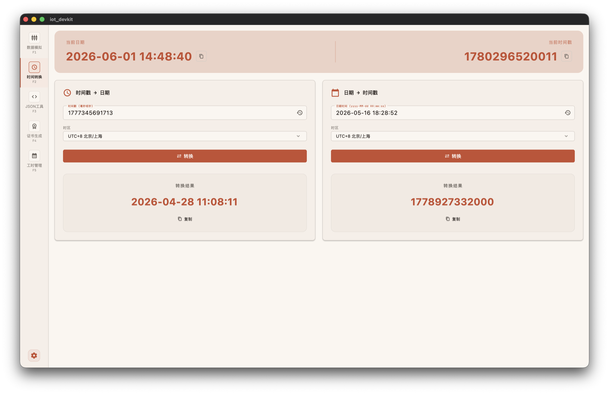
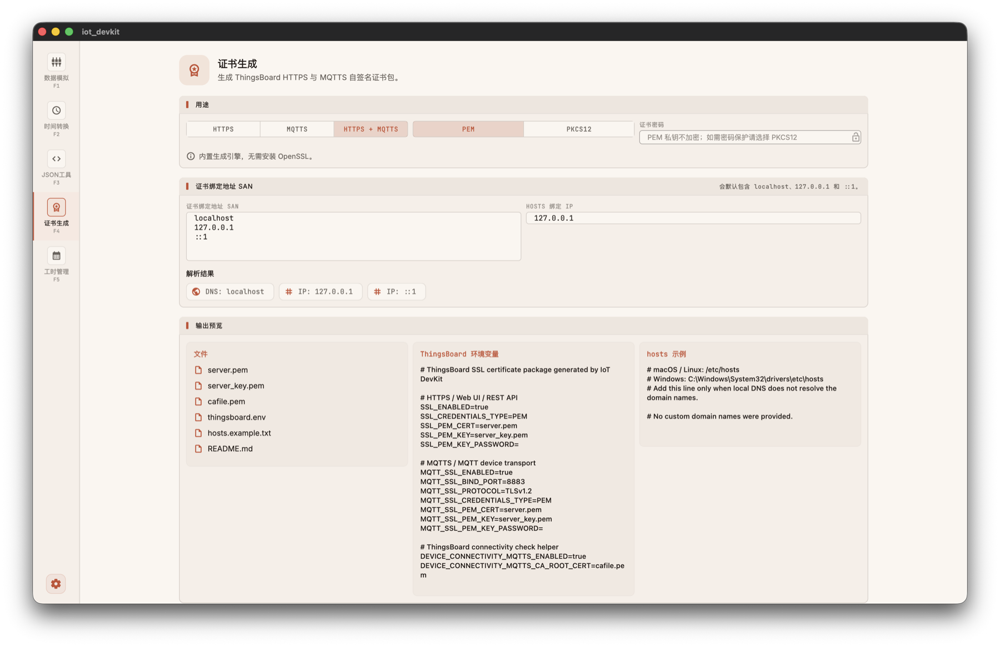
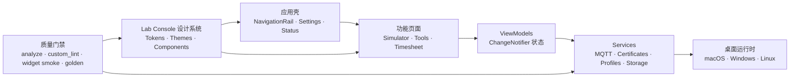

<div align="center">


# IoT DevKit

**面向 IoT 开发者的跨平台桌面工具箱 — Flutter 构建。**

MQTT 设备模拟器 · JSON 格式化 · 时间戳转换 · X.509 证书生成 · 工时记录

[](https://github.com/bcblr1993/iot_devkit_flutter/releases)
[](https://flutter.dev)
[](#-平台支持)
[](https://github.com/bcblr1993/iot_devkit_flutter/actions/workflows/ui_check.yml)
[](https://github.com/bcblr1993/iot_devkit_flutter/actions/workflows/release.yml)
[](https://github.com/bcblr1993/iot_devkit_flutter/stargazers)

[English](README.md) · [简体中文](README_CN.md)

</div>

---

## 📋 目录

- [核心亮点](#-核心亮点)
- [应用截图](#-应用截图)
- [项目架构](#-项目架构)
- [设计系统](#-设计系统)
- [技术栈](#-技术栈)
- [快速开始](#-快速开始)
- [项目结构](#-项目结构)
- [UI 一致性](#-ui-一致性)
- [构建与发布](#-构建与发布)
- [平台支持](#-平台支持)
- [路线图](#-路线图)
- [作者与许可](#-作者与许可)

---

## ✨ 核心亮点

| | 功能 | 说明 |
|---|---|---|
| 📡 | **MQTT 模拟器** | 单设备或上千虚拟设备；发布遥测、主题订阅、RPC 自动确认、profile 导入导出；低延迟发送调度（含 drop-vs-catch-up） |
| 🔐 | **证书生成器** | 一键生成 IoT broker（ThingsBoard / EMQX）所需的 X.509 包：CA + 设备证书 + key + 可部署 zip |
| 🧾 | **JSON 格式化** | 校验/压缩/格式化；可折叠交互式树视图；树内 key/value 搜索；自动持久化输入 |
| ⏱ | **时间戳转换** | 毫秒级实时时钟；Unix ↔ ISO 双向；完整 IANA 时区；一键复制 |
| 📅 | **工时记录** | 工时条目记录；周报一键复制；纯本地持久化 |
| 🎨 | **8 套主题** | Lab Console 设计系统：5 暗（Signal / Plasma / Cobalt / Amber / Mint）+ 3 亮（Paper / Linen / Slate）|
| 🌐 | **国际化** | 完整支持简体中文 + English；所有用户可见文案走 `.arb`，无硬编码 |
| 🖥 | **桌面原生** | macOS / Windows / Linux 三端；窗口状态、文件选择器、原生菜单，非移动端思维 |

---

## 📸 应用截图

下列截图来自当前 macOS Release 构建，统一保存在 [`docs/screenshots/`](docs/screenshots/)。

<table>
<tr>
<td colspan="2" align="center">

<br/><sub><b>MQTT 模拟器</b> · Broker 配置、TLS、订阅、设备范围、指标与日志面板</sub>
</td>
</tr>
<tr>
<td width="50%" align="center">

<br/><sub><b>时间戳转换</b> · 双向 + 时区</sub>
</td>
<td width="50%" align="center">

<br/><sub><b>证书生成器</b> · ThingsBoard HTTPS/MQTTS X.509 证书包预览</sub>
</td>
</tr>
</table>

---

## 🧭 项目架构

IoT DevKit 按桌面产品组织：稳定应用壳、独立功能模块、清晰 service 边界，以及可复现的质量检查和发布流水线。



| 领域 | 职责 |
|---|---|
| 应用壳 | 导航、快捷键、设置、主题/语言切换、状态横幅 |
| 模拟器 | MQTT 连接生命周期、遥测 payload、主题订阅、RPC 自动确认、指标、日志控制台 |
| 工具页 | 时间戳转换、JSON 工具、证书包生成与端点检查 |
| 服务层 | Broker 客户端、发送调度、profile 导入导出、证书生成、本地存储 |
| 设计系统 | Lab tokens、8 套主题、原子组件、自研 lint、golden 基线 |

---

## 🎨 设计系统

Lab Console 设计系统 — 8 套主题 × 5 组原子组件，全部 golden 测试覆盖。下面的 PNG 是 CI 用来卡 PR 的真实渲染基线：

<table>
<tr>
<td align="center" width="50%">

<br/><sub><b>按钮</b> · Signal 主题（暗）</sub>
</td>
<td align="center" width="50%">

<br/><sub><b>按钮</b> · Paper 主题（亮）</sub>
</td>
</tr>
<tr>
<td align="center"><br/><sub><b>表单</b> · 输入框 / 分段 / 复选 / 开关</sub></td>
<td align="center"><br/><sub><b>面板</b> · 分组面板 + 统计卡</sub></td>
</tr>
<tr>
<td align="center"><br/><sub><b>反馈</b> · Pill / 状态点 / 行内提示</sub></td>
<td align="center"><br/><sub><b>弹窗</b> · 确认 + 危险</sub></td>
</tr>
</table>

打开设计系统画廊预览（含全部 8 套主题切换）：

```bash
flutter run -d macos -t lib/main_gallery.dart
```

---

## 🛠 技术栈

| 层 | 选型 |
|---|---|
| 框架 | [Flutter](https://flutter.dev) 3.41.8（Material 3）|
| 语言 | Dart `>=3.0.0 <4.0.0` |
| 状态管理 | [`provider`](https://pub.dev/packages/provider)（`ChangeNotifier`）|
| MQTT | [`mqtt_client`](https://pub.dev/packages/mqtt_client) |
| 本地存储 | [`shared_preferences`](https://pub.dev/packages/shared_preferences) |
| 国际化 | `flutter_localizations` + `.arb` |
| 加密/证书 | [`pointycastle`](https://pub.dev/packages/pointycastle) + [`basic_utils`](https://pub.dev/packages/basic_utils) |
| 图表 | [`fl_chart`](https://pub.dev/packages/fl_chart) |
| 桌面 | [`window_manager`](https://pub.dev/packages/window_manager) + [`file_picker`](https://pub.dev/packages/file_picker) |
| 打包 | [`flutter_distributor`](https://pub.dev/packages/flutter_distributor) + Inno Setup（Windows）|
| 视觉回归 | [`golden_toolkit`](https://pub.dev/packages/golden_toolkit) |
| 静态分析 | `flutter_lints` + 自研 [`lab_lints`](tooling/lab_lints/)（3 条规则）|

---

## 🚀 快速开始

### 前置条件

- 已装 [Flutter SDK](https://flutter.dev/docs/get-started/install) — 项目锁定 `3.41.8` 以保证 CI 可复现
- VS Code 或 Android Studio
- 桌面工具链：Xcode（macOS）、Visual Studio 2022 + 桌面 C++（Windows）、GTK 3（Linux）

### 安装与运行

```bash
git clone https://github.com/bcblr1993/iot_devkit_flutter.git
cd iot_devkit_flutter

flutter pub get
flutter run -d macos          # 或: -d windows / -d linux
```

### 预览设计系统画廊

```bash
flutter run -d macos -t lib/main_gallery.dart
```

---

## 📂 项目结构

```
lib/
├── main.dart                   # 程序入口 + Provider 装配
├── main_gallery.dart           # Lab 设计系统画廊入口
├── l10n/                       # .arb 源文件（en / zh）+ 生成的 AppLocalizations
├── models/                     # 纯数据模型（配置、schema、模拟上下文）
├── viewmodels/                 # ChangeNotifier 状态（MqttViewModel、TimesheetProvider）
├── services/
│   ├── mqtt/                   # 客户端管理 + 发送调度
│   ├── lab_theme_manager.dart  # 8 主题持久化
│   ├── profile_service.dart    # Profile 导入导出
│   ├── certificate_*.dart      # X.509 生成 + zip 打包
│   └── log_storage_service.dart
├── utils/                      # isolate worker、dialog、toast、统计
└── ui/
    ├── shell/                  # NavigationRail + 内容切换 + 状态横幅
    ├── screens/                # 顶层页面（Home、Timesheet）
    ├── lab/                    # ✨ 设计系统 — tokens + 原子组件
    │   ├── tokens/             # LabTokens、LabThemes、OKLCH、文本主题
    │   └── components/         # LabButton / LabField / LabSection / LabDialog / ...
    ├── components/             # 项目通用组件
    ├── tools/                  # 独立工具页（JSON / 时间戳 / 证书）
    ├── widgets/                # 模拟器专用组件
    └── styles/                 # 旧主题常量

tooling/lab_lints/              # 自研 analyzer 规则（颜色 / 间距 / 圆角）
test/golden/                    # 视觉回归基线（signal + paper）
test/widgets/                   # widget smoke 测试
docs/                           # 设计系统文档、UI 一致性指南、发布说明
```

---

## ✅ UI 一致性

项目内置**三层防线**对抗 UI 漂移 — 每个 PR 都会在 CI 跑完：

```
L1  静态     │  flutter analyze  +  dart run custom_lint         （lab_lints 规则）
L2  视觉     │  flutter test test/golden/                         （golden PNG diff）
L3  冒烟     │  flutter test test/widgets/                        （widget smoke）
```

本地一键检查：

```bash
./scripts/ui_check.sh
```

主动调整组件后刷新基线（务必人工 review PNG）：

```bash
./scripts/ui_golden_update.sh [组件名]
```

完整指南 & PR checklist：**[`docs/ui_consistency_guide.md`](docs/ui_consistency_guide.md)**。

---

## 📦 构建与发布

### 手动构建

```bash
flutter build macos   --release   # → build/macos/Build/Products/Release/
flutter build windows --release   # → build/windows/runner/Release/
flutter build linux   --release   # → build/linux/x64/release/bundle/
```

### 本地打分发包

```bash
dart pub global activate flutter_distributor

flutter_distributor release --name release --jobs macos-dmg
flutter_distributor release --name release --jobs windows-exe   # 需要 Inno Setup
```

### CI 自动发布

打 annotated tag（如 `v1.6.6`），[`.github/workflows/release.yml`](.github/workflows/release.yml) 会自动构建 macOS + Windows + Linux 三平台产物并创建 GitHub Release。发布说明优先取 [`docs/releases/vX.Y.Z.md`](docs/releases/)。

---

## 🖥 平台支持

| 系统 | 构建 | 分发形式 |
|---|:-:|---|
| macOS 12+（Intel & Apple Silicon）| ✅ | `flutter_distributor` 生成 `.dmg` |
| Windows 10 / 11（x64）| ✅ | Inno Setup 生成 `.exe` 安装包 |
| Linux（Ubuntu 22.04+）| ✅ | tarball |

> 注意：不能在 macOS / Linux 上直接交叉编译 Windows 产物。请用 [`.github/workflows/release.yml`](.github/workflows/release.yml) 一键三平台。

---

## 🗺 路线图

- [x] MQTT 3.1.1 协议版本选择
- [x] Lab Console 设计系统 + 8 套主题
- [x] UI 一致性三层防线（静态 + 视觉 + 冒烟）
- [ ] 剩余 25 个 legacy 文件迁移到 LabTokens
- [ ] MQTT 5 支持
- [ ] 可插拔的 payload 生成器（自定义 Dart 片段）
- [ ] 历史会话回放

欢迎在 [Issues](https://github.com/bcblr1993/iot_devkit_flutter/issues) 提需求。

---

## 📝 作者与许可

由 **Chen Xu**（[@bcblr1993](https://github.com/bcblr1993)）构建。

许可证：见仓库根目录。如未放置 LICENSE 文件，则视为作者保留全部权利，直到添加正式许可。

<div align="center">

如果它帮你省了时间，欢迎点一个 ⭐ — 这能让更多人发现它。

</div>
